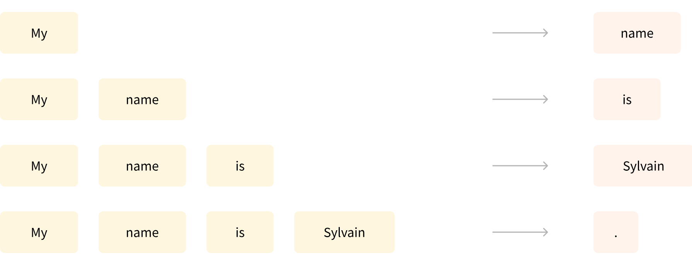

Source - Hugging Face [LLM Course](https://huggingface.co/learn/llm-course/en/chapter1/2)

(Testing with different of type of assets in the content)

## **The Rise of Large Language Models (LLMs)**

In recent years, the field of NLP has been revolutionized by Large Language Models (LLMs). These models, which include architectures like GPT (Generative Pre-trained Transformer) and [**Llama**](https://huggingface.co/meta-llama), have transformed what’s possible in language processing.

> A large language model (LLM) is an AI model trained on massive amounts of text data that can understand and generate human-like text, recognize patterns in language, and perform a wide variety of language tasks without task-specific training. They represent a significant advancement in the field of natural language processing (NLP).


**Transformers are everywhere!**

```python
from transformers import pipeline

classifier = pipeline("sentiment-analysis")
classifier("I've been waiting for a HuggingFace course my whole life.")
```

**Transformers are language models**

All the Transformer models mentioned above (GPT, BERT, T5, etc.) have been trained as ***language models***. This means they have been trained on large amounts of raw text in a self-supervised fashion.

Self-supervised learning is a type of training in which the objective is automatically computed from the inputs of the model. That means that humans are not needed to label the data!

This type of model develops a statistical understanding of the language it has been trained on, but it’s less useful for specific practical tasks. Because of this, the general pretrained model then goes through a process called ***transfer learning***** or *****fine-tuning***. During this process, the model is fine-tuned in a supervised way — that is, using human-annotated labels — on a given task.

An example of a task is predicting the next word in a sentence having read the *n* previous words. This is called *c****ausal language modeling*** because the output depends on the past and present inputs, but not the future ones.




